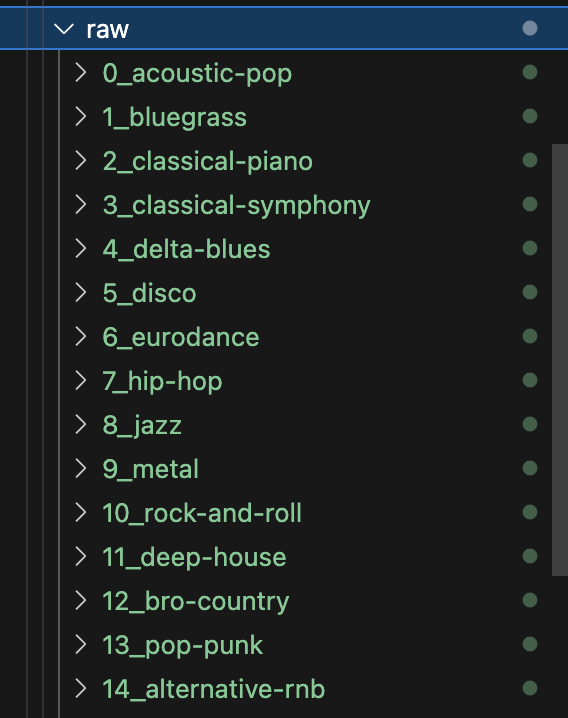
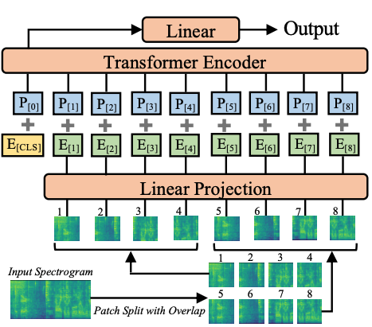

# GenreAST
## Background
GenreAST is a fine-tuned version of Audio Spectrogram Transformer (AST) for predicting music genres based on their audio characteristics. This model was used for research purposes in my BSc paper [*Imbalance Data and Transfer Learning in Music Genre Classification*](https://www.diva-portal.org/smash/record.jsf?dswid=-9811&pid=diva2%3A1963184&c=1&searchType=SIMPLE&language=en&query=caj+norlen&af=%5B%5D&aq=%5B%5B%5D%5D&aq2=%5B%5B%5D%5D&aqe=%5B%5D&noOfRows=50&sortOrder=author_sort_asc&sortOrder2=title_sort_asc&onlyFullText=false&sf=all).

The weight checkpoints are available [here](https://drive.google.com/drive/folders/1jS1banwYNQT5yFDsLxrC62dMI4z8Quvq?usp=sharing). 


Evidently, the model performs surprisingly well for the task of predicting music genres from short audio files of 10 seconds. While music genre prediction may not have that many practical applications, this model can be used as a base model for many other music-related tasks. For more information, please read the paper. 

### Usage
Under scripts, we've included multiple methods for building a pipeline with this model. Once you have your dataset, you'll need to structure it in `/data/raw` according to the following image. 



Note that without any further training, the weights only work for the above classes, but you can fine-tune the model from the given checkpoints for your selection of classes. 

Once everything is structred as above, run the following command from the main folder.
```cli
export PYTHONPATH=$(pwd)
cd scripts
python process_audio.py /path/to/raw
```
Depending on your dataset, it may take a while to process. Once it is done, you'll find the processed files with train, val, and test splits under `/data/processed`. 

**Note, you need to compute the norm values for this dataset using `/data/calculate_norm`, and provide them to the AST feature extraction process, see `constants`**

From this dataset, you can further train the model using `/scripts/train.py`, and evaluate it using `/scripts/evaluate.py`. A helper method for single song prediction is provided in `/scripts/predict_song.py`. Note that all files provided may need modifications for your usecase, the code provided is what has been used in our particular project, with slight modification. 

### AST
The AST model was released in 2021, showing high performance for general audio classification. 


<details>
<summary>BibTeX</summary>

```bibtex
@article{gong2021ast,
  title={AST: Audio Spectrogram Transformer},
  author={Gong, Yuan and Chung, Yu-An and Glass, James},
  journal={arXiv preprint arXiv:2104.01778},
  year={2021}
}
